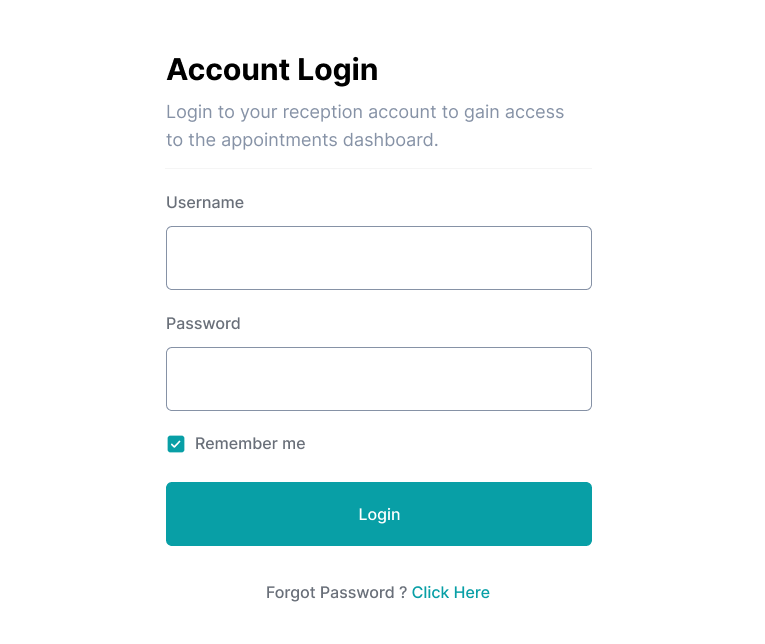
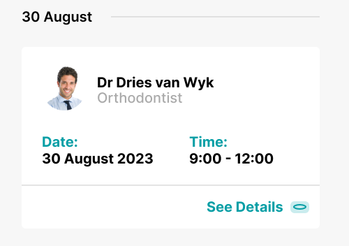
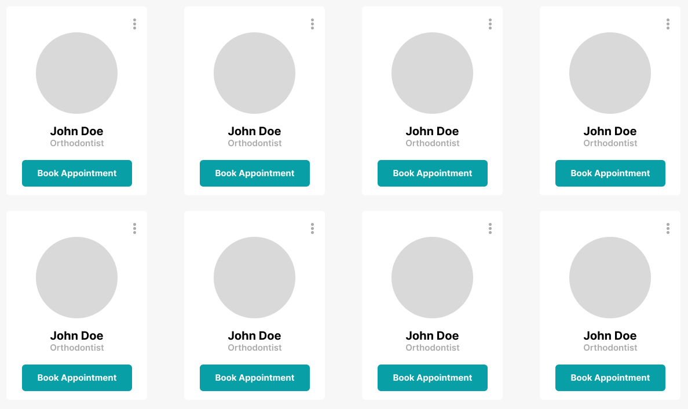
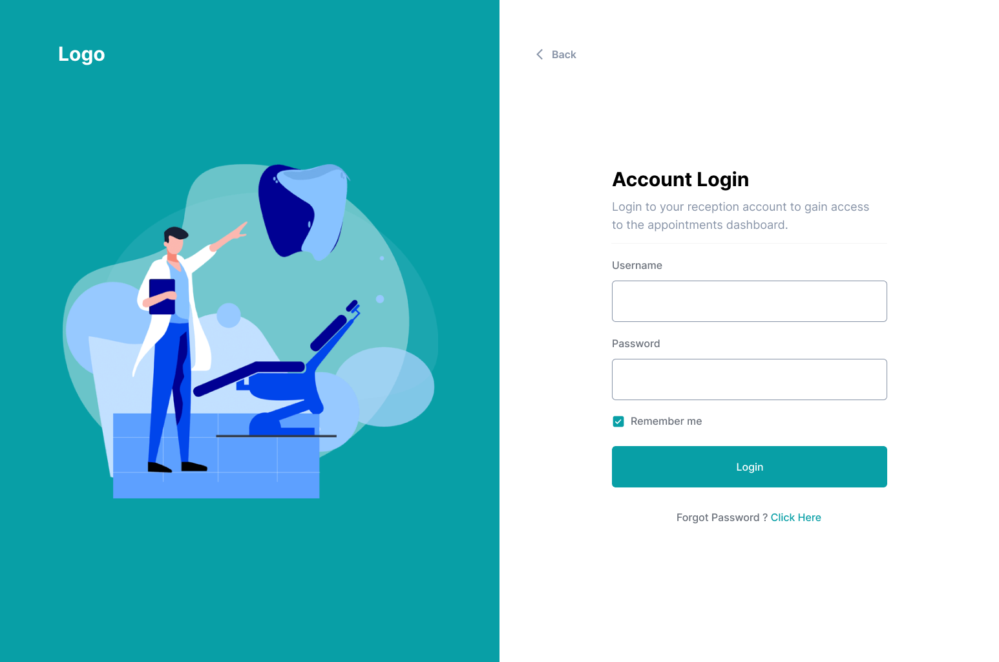
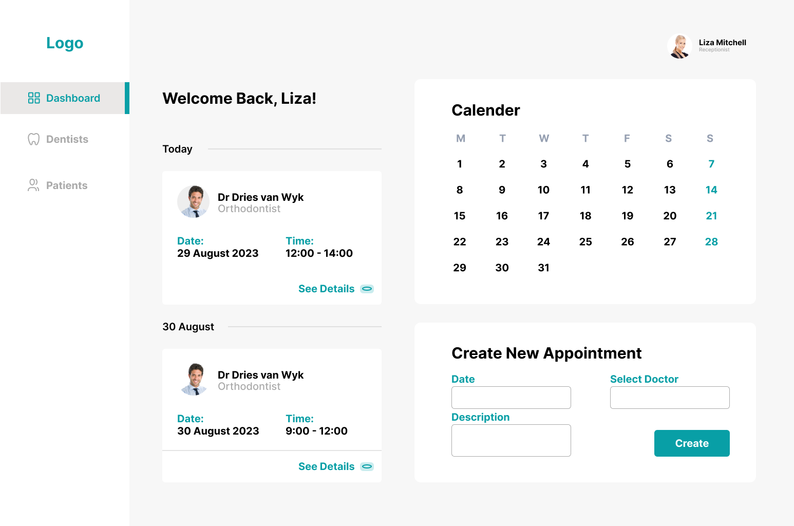
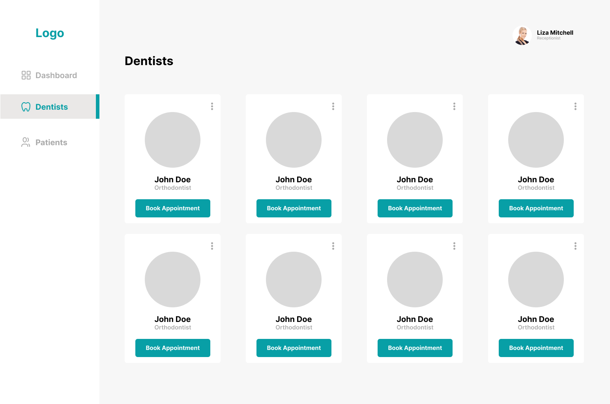

# Interactive Development 200 Term 2 - Dentist


## About the Project

The project I developed is a dental clinic management system. It is designed to streamline various administrative tasks and improve the efficiency of a dental clinic. Here is a short overview of the key features and functionalities:

User Authentication: The system includes a login functionality to ensure secure access. Different user roles are implemented, such as receptionists and administrators, each with their own set of permissions.

Dashboard: The dashboard provides an overview of important information, such as upcoming appointments, statistics, and notifications. It serves as the central hub for users to navigate through the system.

Dentist Management: The system allows for the management of dentists, including adding new dentists, editing their information, and deleting them if necessary. Each dentist has a profile with details such as name, surname, gender, age, email, phone number, and occupation. The addition of profile images for dentists is also supported.

Patient Management: The system enables the management of patients, allowing receptionists to add new patients, update their information, and view their details. Patient information typically includes name, contact details, medical history, and any upcoming or past appointments.

Appointment Scheduling: The system provides functionality to schedule appointments for patients. Receptionists can create, reschedule, and cancel appointments, while dentists can view their schedule and upcoming appointments. The scheduling feature includes date and time selection, as well as integration with the patient and dentist records.

Database Integration: The system integrates with a database to store and retrieve data, such as dentist and patient information, appointment details, and user credentials. The use of a database enhances data management and allows for efficient retrieval and manipulation of information.

User Interface: The system includes a user-friendly interface with a responsive design. It utilizes HTML, CSS, and JavaScript to create visually appealing and intuitive web pages. The interface ensures easy navigation and accessibility across different devices.

Overall, the dental clinic management system I developed provides a comprehensive solution for managing dentists, patients, and appointments. It improves administrative tasks, enhances organization, and facilitates effective communication within the dental clinic.

## Getting Started

## Dependencies

The following dependencies have been installed for this project:

- **@testing-library/jest-dom:** ^5.16.5
- **@testing-library/react:** ^13.4.0
- **@testing-library/user-event:** ^13.5.0
- **axios:** ^1.3.4
- **bootstrap:** ^5.2.3
- **chart.js:** ^4.2.1
- **chartjs-adapter-date-fns:** ^3.0.0
- **chartjs-adapter-moment:** ^1.0.1
- **coinranking-api:** ^1.0.0
- **date-fns:** ^2.29.3
- **moment:** ^2.29.4
- **react:** ^18.2.0
- **react-chartjs-2:** ^5.2.0
- **react-dom:** ^18.2.0
- **react-router-dom:** ^6.10.0
- **react-scripts:** 5.0.1
- **web-vitals:** ^2.1.4

### Prerequisites

Before getting started, ensure you have the following software installed:

- [React](https://react.dev/learn/installation)
- [Chart.js](https://www.chartjs.org/docs/latest/getting-started/installation.html)
- [Coinranking](https://developers.coinranking.com/api/documentation)
- [React Router](https://reactrouter.com/en/main)

### Installation

To set up the project and install the necessary dependencies, follow these steps:

1. Clone the repository from GitHub using the following command:

   ```bash
   git clone https://github.com/your-username/your-repository.git

Replace your-username and your-repository with your actual GitHub username and repository name.

2. Navigate to the project directory:

   cd your-repository

3. Install the required dependencies using NPM:

   npm install

This will install all the dependencies listed in the package.json file, including the specific versions specified for each package.

4. Handle any potential errors or conflicts during the installation process, and refer to the documentation for each dependency for more detailed setup instructions if needed.

   Make sure to replace the placeholders such as your-username and your-repository with your actual GitHub username and repository name. Feel free to customize the instructions as needed to match your project specifics.

## Features and Functionality

The "Crypto Compare" application offers the following key features:

1. **Landing Dashboard:** Presents a comprehensive overview and breakdown of the most relevant properties of the selected cryptocurrency data set, using interactive Chart.js elements to visualize data.
   


2. **Comparison Page:** Includes a dedicated page for comparing two distinct objects from the data set. It utilizes Bar, Pie, and Radar chart to outline and compare the properties of the selected objects.



3. **Timeline Page:** Displays a dynamic Line Graph that maps the entries of at least 5 different properties across the entire dataset. The timeline is interactive and allows users to change the displayed property via an input.



## Concept Process

The development process involved the following stages:

### Ideation

The project was conceptualized with the primary aim of simplifying the process of comparing various cryptocurrencies. Taking inspiration from existing cryptocurrency comparison platforms, I brainstormed and designed wireframes to ensure an intuitive user interface.

### User-side Wireframes

The project's wireframes were meticulously designed, including the home, compare, and timeline screens.





## Development Process

### Highlights

During the development phase, I focused on creating a user-friendly cryptocurrency comparison tool with a comprehensive range of functionalities. The project involved meticulous exploration of cryptocurrency data and the seamless integration of APIs to facilitate efficient data retrieval and visualization. With a strong emphasis on user experience, I strived to ensure intuitive navigation and clear presentation of complex cryptocurrency data. Leveraging the latest technologies in the blockchain space, the project aimed to provide users with a seamless and insightful comparison of various cryptocurrencies, empowering them to make informed investment decisions.

### Challenges

Throughout the development process, I encountered significant challenges primarily focused on implementing complex chart functionalities and effectively pulling data from the Coinranking API. Overcoming these obstacles provided valuable insights into the intricacies of data visualization and API integration, contributing to an enhanced understanding and proficiency in handling intricate cryptocurrency data sets.```

## Future Implementation

Moving forward, the "Crypto Compare" project has several areas for potential enhancements, including code optimization, increased user interactivity, and enhanced visual engagement. I plan to streamline the code further, improve overall consistency, and introduce additional interactive features to enhance the user experience.

## Conclusion

The "Crypto Compare" project has provided me with an invaluable learning experience, highlighting the significance of effective communication, dedicated effort, and technical expertise. Despite the challenges encountered during the development process, this project has been instrumental in enhancing my problem-solving abilities and solidifying my understanding of essential software development principles. I look forward to implementing additional features and improvements in the future, leveraging the valuable knowledge gained from this project.

## Contact

For any inquiries or further information, please feel free to reach out to:

- **Tristan Storm** - [221195@virtualwindow.co.za]
- **Project Link** - [Project Link](https://github.com/Tristanstormmm/FinalHandIn221195)
